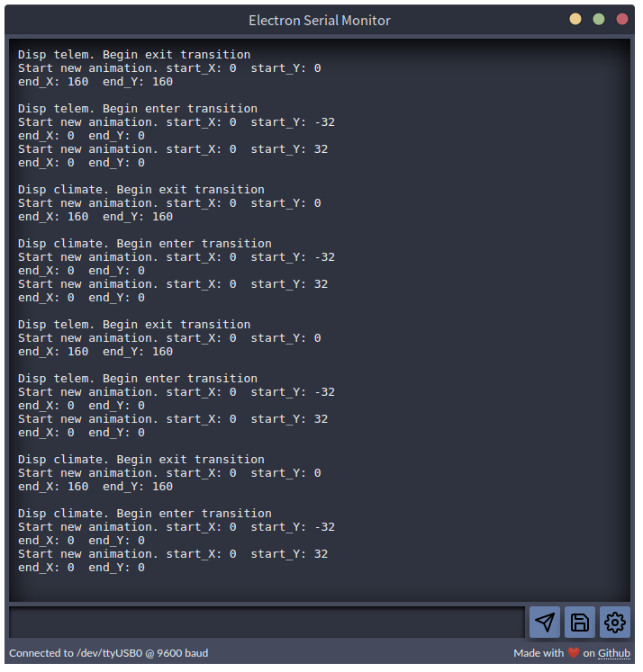

[![MIT License][license-shield]][license-url]

<p align="center">
  <h2 align="center">Electron Serial Monitor</h2>
  <p align="center">
    Cross Platform Serial Monitor written using Electron and NodeJS
  </p>
</p>

<br />

## Table of Contents
* [About the Project](#about-the-project)
  * [Built With)[#built-with]
* [Getting Started](#getting-started)
  * [Retrieving the Source](#retrieving-the-source)
  * [Installation](#installation)
  * [Building](#building)
  * [Debugging](#debuggin)
  * [Packaging](#packaging)
* [Contributing](#contributing)
* [License](#license)
* [Contact](#contact)
* [Acknowledgements](#acknowledgements)

## About the Project

<p align="center">
  
</p>

The Electron Serial Monitor is a learning experience for myself to dive deeper into "Web" development. It really serves two purposes: 
* Provided a useful tool for development of Embedded Electronic projects.
* Introduce myself into the Web development atmosphere (JS, HTML, CSS, etc), without having to build a boring personal portfolio site.

The project is open source with the hope that others can get use, improve, and learn from it. Contributions are absolutely welcome and if you are interested in doing so, please visit the [Contributing](#contributing) section.

### Built With

The application is built with two primary tools. Both are required to build and develop this project.
* [NodeJS](https://nodejs.org/en/)
* [Electron](https://www.electronjs.org/)

## Getting Started

To get a local copy of the source up and running follow these simple steps

### Retrieving the Source

```sh
$ git clone https://github.com/stephendpmurphy/serial-monitor.git
```

### Installation

```sh
$ npm install
```

### Building

To build the application, you will first need to compile the styling sass source:
```bash
$ npm run compile:sass
```

Once complete, you can run the application:
```bash
$ npm start
```

### Debugging

You can debug the application within VScode by first installing the [**Chrome Debugging Extension for VScode**](https://marketplace.visualstudio.com/items?itemName=msjsdiag.debugger-for-chrome). With the extension installed, you can debug both the Main and Renderer processes by using the "Electron: All" target.

### Packaging

To create a distributable package using electron-forge:
```bash
$ npm run make
```


## Contributing

Any contributions you make are **greatly appreciated**. You can contribute to the project by following this workflow
1. Fork the Project
2. Create your Feature Branch (`git checkout -b feature/AmazingFeature`)
3. Commit your Changes (`git commit -m 'Add some AmazingFeature'`)
4. Push to the Branch (`git push origin feature/AmazingFeature`)
5. Open a Pull Request

## License

Distributed under the MIT License. See `LICENSE` for more information.

## Contact

Your Name - [@your_twitter](https://twitter.com/your_username) - email@example.com

Project Link: [https://github.com/your_username/repo_name](https://github.com/your_username/repo_name)

## Acknowledgements
* [Feather Icons](https://feathericons.com/)
* [Nord Theme](https://www.nordtheme.com/)

[license-shield]: https://img.shields.io/github/license/othneildrew/Best-README-Template.svg?style=flat-square
[license-url]: https://github.com/stephendpmurphy/serial-monitor/blob/main/LICENSE
